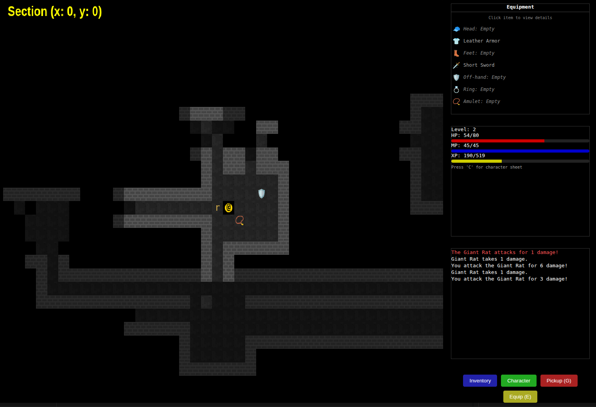

# Modern Roguelike

**Version 0.4.0 "Arcane Awakening"** | October 2025

A modern roguelike game built with vanilla JavaScript and HTML5 Canvas. Features procedurally generated dungeons, tactical combat, magic system, and an immersive exploration experience.

## 🎮 Features

- **Magic System**: 10 spells across offensive, healing, and utility categories with projectile-based combat
- **Spell Scaling**: Intelligence-based damage scaling with level bonuses for character progression
- **Status Effects**: Damage over time, healing over time, buffs, debuffs, stun, and slow effects
- **Tactical Combat**: Strategic turn-based combat system with various monsters and weapons
- **Character Progression**: Stat point allocation system enabling wizard, warrior, and hybrid builds
- **Procedural Generation**: Dynamically generated dungeons with varied layouts and challenges
- **Inventory System**: Comprehensive item management with equipment, consumables, and loot
- **Field of View**: Realistic line-of-sight and fog of war mechanics
- **World Management**: Multi-section world with seamless transitions
- **Modular Architecture**: Clean, extensible codebase with separated concerns
- **Rich UI**: Intuitive interface with inventory, character screen, and help system



## 🚀 Getting Started

### Prerequisites

- Node.js (v14 or higher)
- npm or yarn package manager
- Modern web browser

### Installation

1. Clone the repository:
```bash
git clone <repository-url>
cd NewRoguelike
```

2. Install dependencies:
```bash
npm install
```

3. Start the development server:
```bash
npm start
```

4. Open your browser and navigate to `http://localhost:8080` (or the port specified)

**For development with cache disabled:**
```bash
npx http-server . -p 8080 -c-1 -o
```

## 🎯 How to Play

### Controls

- **Arrow Keys**: Move your character
- **G**: Pick up items
- **E**: Equip items
- **I**: Toggle inventory
- **C**: Toggle character screen
- **H**: Toggle help screen
- **M**: Toggle map reveal (debug/cheat mode)
- **Shift+G**: Show gate debug information

### Gameplay

1. **Movement**: Use arrow keys to move through the dungeon
2. **Combat**: Attack monsters by moving into them
3. **Items**: Pick up items with 'G' and equip them with 'E'
4. **Exploration**: Uncover the map as you move through areas
5. **Progression**: Advance through different dungeon levels and areas

## 🏗️ Project Structure

```
src/
├── js/
│   ├── main.js              # Main game loop and initialization
│   ├── menu.js              # Main menu system
│   └── modules/
│       ├── dungeon.js       # Dungeon generation
│       ├── renderer.js      # Game rendering
│       ├── gameStateManager.js  # Game state management
│       ├── cameraManager.js     # Camera and viewport
│       ├── fovManager.js        # Field of view calculations
│       ├── combatManager.js     # Combat system
│       ├── inputManager.js      # Input handling
│       ├── worldManager.js      # World sections and transitions
│       ├── entity/
│       │   ├── player.js        # Player character
│       │   ├── monster.js       # Monster entities
│       │   └── monsterDatabase.js # Monster definitions
│       ├── items/
│       │   ├── itemManager.js   # Item management
│       │   ├── inventory.js     # Inventory system
│       │   ├── item.js          # Base item class
│       │   └── equipment.js     # Equipment system
│       └── ui/
│           ├── gameUI.js        # Main game UI
│           ├── inventoryUI.js   # Inventory interface
│           └── helpScreen.js    # Help system
└── css/
    ├── style.css            # Main game styles
    └── menu.css             # Menu styles
```

## 🔧 Development

### Architecture

The game follows a modular architecture with clear separation of concerns:

- **Game Loop**: Handles updates and rendering
- **State Management**: Manages game states (playing, paused, game over)
- **Entity System**: Player, monsters, and items
- **World System**: Dungeon generation and world management
- **UI System**: User interface components
- **Input System**: Input handling and key bindings

### Key Components

- **GameStateManager**: Manages overall game state
- **CameraManager**: Handles viewport and camera movement
- **FOVManager**: Calculates field of view and visibility
- **CombatManager**: Handles all combat interactions
- **WorldManager**: Manages world sections and transitions
- **ItemManager**: Handles item interactions and inventory

## 📚 Documentation

Additional documentation can be found in the `documentation/` folder:

- `functionality_documentation.md` - Core game mechanics
- `dungeon_generation.md` - Dungeon generation algorithms
- `magic_system.md` - Magic system reference and spell database
- `spell_scaling_implementation.md` - Spell scaling and progression system
- `versioning.md` - Version management and release workflow
- `multiplayer_roadmap.md` - Future multiplayer features
- `developer_log.md` - Development notes and progress
- `player_guide.md` - Comprehensive player guide

See also:
- `CHANGELOG.md` - Complete version history and roadmap

## 🎥 YouTube Dev Log

- [I vibe coded a Roguelike game with Claude Code](https://youtu.be/y9RRpOgV9yg)

## 🎵 Acknowledgments

- Built with vanilla JavaScript for maximum compatibility
- Inspired by classic roguelike games
- Uses HTML5 Canvas for rendering
- Modular design for easy extension and maintenance